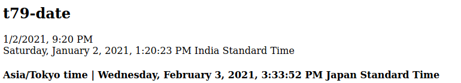

# T79 Components
A bunch of web components to make server side rendering easier

by default sets the time to the users current time zone, the behaviour can be modified via JavaScript

## Defined Tags
```html
<t79-date>
<t79-date-set>
```

## requirements
- luxon javascript library, from
`<script src="https://cdn.jsdelivr.net/npm/luxon@1.25.0/build/global/luxon.min.js" integrity="sha256-OVk2fwTRcXYlVFxr/ECXsakqelJbOg5WCj1dXSIb+nU=" crossorigin="anonymous"></script>`
(see luxon docs at https://moment.github.io/luxon/docs/)

### t79-date

the date tag is used to represent utc dates as the local time (or user-defined time) for the user

**attributes**
  - time-utc,
      the utc defined time

  - format,
      the format to set it at, defaults to "DATETIME_MED" if unspecified, see https://moment.github.io/luxon/docs/manual/formatting.html#presets for an entire list of presets

### t79-date-set

this tag is used to dynamically set the timezone for a selected set of tags or all tags, if this tag is not used, the user's local timezone will be used

## including the tag

```html
<script src="https://cdn.jsdelivr.net/npm/luxon@1.25.0/build/global/luxon.min.js" integrity="sha256-OVk2fwTRcXYlVFxr/ECXsakqelJbOg5WCj1dXSIb+nU=" crossorigin="anonymous"></script>
<script src="https://cdn.jsdelivr.net/gh/therealadityashankar/t79-components@0.0.3/components/t79-date/main.js" integrity="sha384-1v8YKtd61HQBAfwOl6tYheWGt+WFZoK3rZdUTK2/GJvPC6pSRIzRBGeWJ+/k4u3G" crossorigin="anonymous"></script>
```

altenatively you may also get the component locally by downloading it from `components/t79-date/main.js`

### example tag usage:

for `<t79-date>`,

here, utc-time-string is an [ISO 8601](https://en.wikipedia.org/wiki/ISO_8601) time string,
```html
<t79-date time-utc="{utc-time-string}"></t79-date>
<t79-date time-utc="2021-01-02T07:50:23Z"></t79-date>
<t79-date sel="group-1" time-utc="{utc-time-string}"></t79-date>
```

for `<t79-date-set>`,

for setting the default time zone
```html
<t79-date-set time-zone="Asia/Kolkata">
<t79-date-set sel="default" time-zone="Asia/Kolkata"> <!-- equivalent to the above tag -->
```

for setting the time zones for some selections
```html
<t79-date-set sel="group-1" time-zone="Asia/Kolkata">
```

### representation image:

example code:
```html
<h2> t79-date </h2>
<t79-date time-utc="2021-01-02T15:50:23Z"></t79-date>
<br>
<t79-date time-utc="2021-01-02T07:50:23Z" format="DATETIME_HUGE_WITH_SECONDS"></t79-date>

<h4>Asia/Tokyo time | <t79-date sel="tokyo" time-utc="2021-02-03T06:33:52+00:00" format="DATETIME_HUGE_WITH_SECONDS"></t79-date></h4>
<t79-date-set sel="tokyo" timezone="Asia/Tokyo"></t79-date-set>
```



### component javascript api
- t79.date.setZone(sel, timezone)

Parameters:
- **sel** : the t79-date selections that this timezone should apply to, if the keyword "default" is used, sets the global timezone
- **timezone** : the timezone to set them to, see list of timezones here : https://www.timeanddate.com/time/zone/france

example:
```js
// for setting it as the default
t79.date.setZone("default", "Asia/Kolkata")

// for changing it for some tags
t79.date.setZone("some-tags", "Asia/Kolkata")
```
